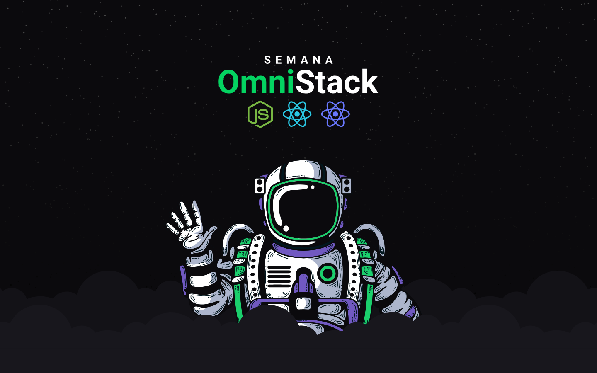

# **Semana OmniStack [Rocketseat](https://github.com/Rocketseat) - Instarocket App**
> This repository was created for the case study in the #nodejs, #react, and # react-native stack. Re-creating the application similar to Instagram in the OS Linux.  



# Instructions
## __*Prerequisites*__
**You should have installed:**
- [Nodejs](https://nodejs.org)
- [Npm](https://www.npmjs.com/)
- [Yarn](https://yarnpkg.com)
- [Insomnia](https://insomnia.rest/)
    - Used to test routes like GET, POST, PUT or DELETE.
- [Genymotion](https://www.genymotion.com/)
    - Used to emulate native Android app.


---

## __*Usage*__
This project is divided into three main folders:

## **`backend/`**
> API rest created to serve the application with Nodejs and Mongodb. 

 In this folder, run the following commands:
```js
$ npm install // install dependencies

$ yarn dev // watching server local
```
---
## **`frontend/`**
> Interface web desktop of the aplication in React. 
This project was bootstrapped with [Create React App](https://github.com/facebook/create-react-app). More details [here](frontend/README.md).  

 In this folder, run the following commands:
```js
$ npm install // install dependencies

$ yarn start // starts development environment for react
```
---
## **`instarocket/`**
> Interface mobile of the aplication in React-native  

 In this folder, run the following command:
```js
$ npm install // install dependencies
```


For the installation and configuration of the all mobile environment according to your OS, you need follow this [guide](https://docs.rocketseat.dev/ambiente-react-native/introducao).


 After in this folder, run the following command:
```js
$ react-native run-android // starts development environment for react-native in ANDROID emulador

$ react-native run-android // starts development environment for react-native in IOS emulador

$ react-native start // starts metro bundler
```

## __*Built With the Stack*__

* [NodeJS](https://www.themoviedb.org) - Create the API of consuming data.
* [React](https://www.themoviedb.org) - Create interface web desktop of the aplication.
* [React-Native](https://www.themoviedb.org) - Create interface mobile of the aplication.
* [MongoDB Atlas](https://www.mongodb.com/cloud/atlas) - Database of the aplication.


## __*Authors*__

[**Guilherme Almeida**](https://guisalmeida.com)

See also the list of [contributors](https://github.com/GuiSAlmeida/Imagiflix/contributors) who participated in this project.